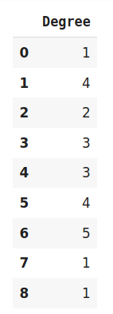
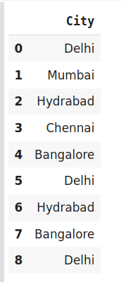
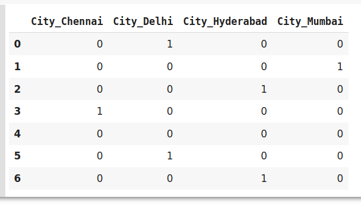
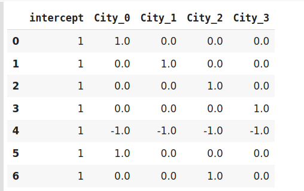
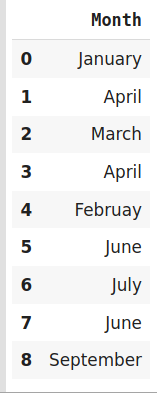
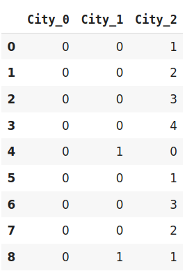
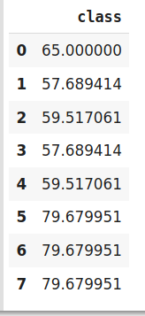
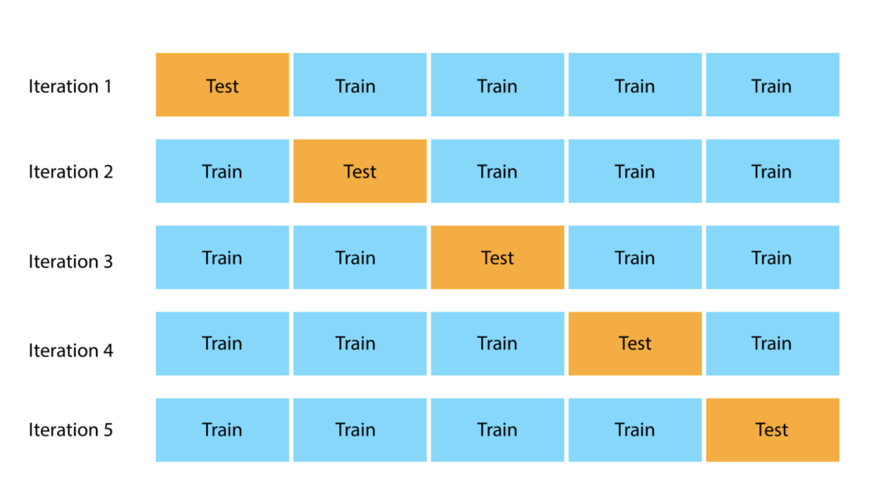
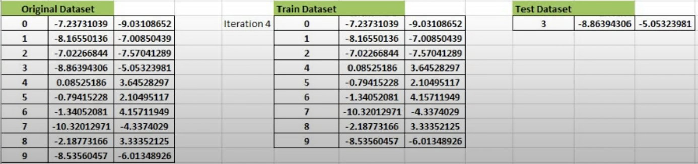

#TODO
1. Distributions
2. Regularization
3. Bayes Theorem
4. Models pros and cons
5. Fairness Fundamentals 
6. Recommendation Fundamentals
7. Testing Fundamentals
8. Evaluations

#Fundamentals
#### Under-fitting vs Over-fitting (Bias vs Variance)
<b> Under-fitting </b> - High bias and low variance. It cannot capture the underlying trend of the data.
It destroys the accuracy of our machine learning model. Your model is under-fitting the training data when the model 
performs poorly on the training data. 
  <b>Techniques to reduce under-fitting:</b>

* Increase model complexity
* Increase number of features, performing feature engineering
* Remove noise from the data.
* Increase the number of epochs or increase the duration of training to get better results.
 
<b> Over-fitting </b> - Low bias and high variance.  Your model is over-fitting your training data when you see that the model 
performs well on the training data but does not perform well on the evaluation data. 
  <b>Techniques to reduce over-fitting:</b>

* Increase training data.
* Get more data.
* Reduce model complexity.
* Early stopping during the training phase (have an eye over the loss over the training period as soon as loss begins to increase stop training).
* Ridge Regularization and Lasso Regularization.
* Use dropout for neural networks to tackle over-fitting.
* Reduce the number of features (only select features that are relevant to the target variable you want to predict.
* Use Cross-validation

[Source: Under-fitting vs Over-fitting (Bias vs Viarence)](https://www.geeksforgeeks.org/underfitting-and-overfitting-in-machine-learning/)

#### Encode Categorical Variables
Nominal vs Ordinal - Nominal columns have no hierarchy such as gender, age, etc. where Ordinal columns do have ordering 
such as grade level, high/medium/low, etc.

<b> Label Encoding or Ordinal Encoding </b> - Used when the feature is a hierarchy such as High school, Bachelors, Masters, etc. where High school = 1,..., Masters = 3. This mapping is done manually be the coder.
 

<b> One Hot Encoding </b> - Splits n unique attributes into n feature columns where 1 is placed into the column if the datapoint contains such attribute otherwise 0 is placed. 
 

<b> Dummy Encoding </b> - This is similar to One Hot Encoding however it differs as dummy encoding using -1 binary variables meaning dummy encoding will have a row with 0 0 0 within the dataset.
 

<b> Effect Encoding </b> - This is similar to Dummy Encoding however it different as effect encoding uses -1 instead of a row of all zeros which would look as -1 -1 -1.
 

<b> Hash Encoder </b> - Just like one-hot encoding, the Hash encoder represents categorical features using the new dimensions. By default, the Hashing encoder uses the md5 hashing algorithm but a user can pass any algorithm of his choice.
 

<b> Binary Encoding </b> - Binary encoding is a combination of Hash encoding and one-hot encoding. In this encoding scheme, the categorical feature is first converted into numerical using an ordinal encoder. Then the numbers are transformed in the binary number.
 

<b> Base N Encoding </b> - For Binary encoding, the Base is 2 which means it converts the numerical values of a category into its respective Binary form. If you want to change the Base of encoding scheme you may use Base N encoder. In the case when categories are more and binary encoding is not able to handle the dimensionality then we can use a larger base such as 4 or 8.
 

<b> Target Encoding </b> - In target encoding, we calculate the mean of the target variable for each category and replace the category variable with the mean value.
 

[Source: Encode Categorical Variables](https://www.analyticsvidhya.com/blog/2020/08/types-of-categorical-data-encoding/)

#### Handling Missing Values
<b> Deleting Rows with missing values </b>

Pros:
* A model trained with the removal of all missing values creates a robust model.

Cons:
* Loss of a lot of information.
* Works poorly if the percentage of missing values is excessive in comparison to the complete dataset.

<b> Using the mean/medium - Impute missing values for continuous variable </b>

Pros:
* Prevent data loss which results in deletion of rows or columns
* Works well with a small dataset and easy to implement.

Cons:
* Works only with numerical continuous variables.
* Can cause data leakage
* Does not factor the covariance between features.

<b> Using most frequent category - Impute missing values for categorical variable </b>

Pros:
* Prevent data loss which results in deletion of rows or columns
* Works well with a small dataset and easy to implement.
* Negates the loss of data by adding a unique category

Cons:
* Works only with categorical variables.
* Addition of new features to the model while encoding, which may result in poor performance

<b> Using Algorithms that support missing values </b>

Algorithms :
* k-NN
* Naive Bayes

Pros:
* No need to handle missing values in each column as ML algorithms will handle it efficiently

Cons:
* No implementation of these ML algorithms in the scikit-learn library.

<b> Prediction of missing values </b>

Algorithms :
* missforest

Pros:
* Gives a better result than earlier methods

Cons:
* Considered only as a proxy for the true values

[Source: Handling Missing Values](https://towardsdatascience.com/7-ways-to-handle-missing-values-in-machine-learning-1a6326adf79e)

### Cross Validation

### Non-exhaustive Methods

#### Hold Out Method

The dependent variable (target variable - what you're trying to predict) and the independent variables should be split into x and y variables.
Where x holds all the independent variables and y holds the y variable. X will normally have multiple feature columns whereas 
Y will have a single feature column. 

1. <b> Training set </b>: A set of examples used for learning, that is to fit the parameters of the classifier.
2. <b> Validation set </b>: A set of examples used to tune the parameters of a classifier, for example to choose the number of hidden units in a neural network.
3. <b> Test set </b>: A set of examples used only to assess the performance of a fully-specified classifier.

This data is normally broken down into 80 train - 20 test. Test data is then split into 10 test - 10 validation.
These numbers are subjective and can be changed as needed.

Common split percentages include:
* Train: 80%, Test: 20%
* Train: 67%, Test: 33%
* Train: 50%, Test: 50%

#### k-Fold Cross Validation

The general procedure is as follows:

* Shuffle the dataset randomly.
* Split the dataset into k groups
* For each unique group:
1. Take the group as a hold out or test data set
2. Take the remaining groups as a training data set
3. Fit a model on the training set and evaluate it on the test set
4. Retain the evaluation score and discard the model
* Summarize the skill of the model using the sample of model evaluation scores

#### Stratified K Fold Cross Validation

Stratified K Fold Cross Validation works similar to k-Fold Cross Validation. It differs in the since that the stratification is the process of rearranging the data so as to ensure that each fold is a good representative of the whole. For example, in a binary classification problem where each class comprises of 50% of the data, it is best to arrange the data such that in every fold, each class comprises of about half the instances.

### Exhaustive Methods

#### Leave-P-Out cross validation

We take p number of points out from the total number of data points in the dataset(say n). While training the model we train it on these (n – p) data points and test the model on p data points. We repeat this process for all the possible combinations of p from the original dataset. Then to get the final accuracy, we average the accuracies from all these iterations.

#### Leave-one-out cross validation

This is a simple variation of Leave-P-Out cross validation and the value of p is set as one. This makes the method much less exhaustive as now for n data points and p = 1, we have n number of combinations.

[Source: Train vs. Test vs. Validation set](https://machinelearningmastery.com/difference-test-validation-datasets/)

[Source: Common split percentages](https://machinelearningmastery.com/train-test-split-for-evaluating-machine-learning-algorithms/)

[Source: Cross Validation](https://www.mygreatlearning.com/blog/cross-validation/#sh211)

[Source: LOOCV and LPOCV Video](https://www.youtube.com/watch?v=yxqcHWQKkdA)

#### Handling imbalanced data
1. <b> Oversampling </b> - Random oversampling involves randomly duplicating examples from the minority class and adding them to the training dataset.
2. <b> Undersampling </b> - Random undersampling involves randomly selecting examples from the majority class to delete from the training dataset.
3. <b>Synthetic Minority Oversampling TEchnique (SMOTE) </b> - SMOTE draws artificial samples by choosing points that lie on the line connecting the rare observation to one of its nearest neighbors in the feature space.
4. <b> Random OverSampling Examples (ROSE) </b> - ROSE uses smoothed bootstrapping to draw artificial samples from the feature space neighbourhood around the minority class.

[Source: Over and Undersampling](https://machinelearningmastery.com/random-oversampling-and-undersampling-for-imbalanced-classification/)

[Source: ROSE and SMOTE explained](https://stats.stackexchange.com/questions/166458/rose-and-smote-oversampling-methods)

[Source: ROSE and SMOTE in R](https://topepo.github.io/caret/subsampling-for-class-imbalances.html#resampling)

#### Basic Stats
1. Likelihood - Generally maximizing the chances of a particular situation to occur. Probability attaches to possible results.
2. Probability - Finding the chance of occurrence of a particular situation. Likelihood attaches to hypotheses.
3. Standard Deviation - A measure of how spread out numbers are.
4. Variance - Measures variability from the average or mean.

5. Z-Test - The statistical hypothesis which is used in order to determine that whether the two samples means calculated are different in case the standard deviation is available and sample is large.
6. T-Test - To determine a how averages of different data sets differs from each other in case standard deviation or the variance is not known.

Conditions to use T-test
* Standard Deviation is unknown
* Sample size < 30

[Source: Likelihood vs Probability](https://medium.com/swlh/probability-vs-likelihood-cdac534bf523)

[Source: Standard Deviation](https://www.investopedia.com/terms/v/variance.asp)

[Source: Variance](https://www.mathsisfun.com/data/standard-deviation.html)

[Source: When to use Z vs. T-Test](https://www.youtube.com/watch?v=YsalXF5POtY)

[Source: Z vs. T-Test](https://www.wallstreetmojo.com/z-test-vs-t-test/)

#### Stats for Measuring Significance
<b> Statistical Hypothesis Tests </b>

* Hypothesis - claim to be tested 
* Null Hypothesis - commonly accepted fact (Grades due to poor teaching performance)
* Alternative Hypothesis - claim to be tested (Grades due to lack of ventilation)
* Outcomes: Reject the null hypothesis or fail to reject the null hypothesis
* Confidence Level: Indicates the confidence you have in your results

<b> P-Values </b>

* Note: Used to see the significance of a feature 
* The p-value is the probability of obtaining results at least as extreme as the observed results of a statistical hypothesis test, assuming that the null hypothesis is correct. A smaller p-value means that there is stronger evidence in favor of the alternative hypothesis.

Common significant levels include:
* 0.5
* 0.1
* 0.001

<b> ANOVA (Multi-Level Categorical | Categorical vs. Numeric) </b>

* Analysis of variance (ANOVA) can determine whether the means of  two or more groups are different (SE, SES, and SEL)
* One-way ANOVA is used when you want to study the relationship between one independent categorical variable and a numeric response variable
* Multi-way ANOVA is used when you want to study the relationship between multiple independent categorical variables and a numeric response variable

<b> Crosstabs (Categorical vs. Categorical) </b>

* Crosstabs (or contingency tables) are used to study the relationship between two nominal variables. A crosstab  is a table in which the rows are the levels of one variable, while the columns are the levels of another. Counts in each of the table's cells indicate the number of values falling into the particular row and column combination.

<b> Chi Square Test (Categorical vs. Categorical) </b>

* Test for independence between the two nominal variables using the crosstab (contingency table). 
* The test measures how likely it is that the difference in the cell counts in the table is due to chance alone.
* If the probability is very low, it provides strong evidence that the two variables are associated.
* If the chi-square test statistics is greater than the critical value, the null hypothesis is rejected and we can conclude that the two sample variables are not independent

Please note: 

* Chi-square does not tell us anything about the strength of association between two nominal variables. If you want to know strength of association, you should use other measures such as odds ratio, relative risk, etc.
* For very large sample sizes, even very small unimportant differences are detectable which means you can get a very small p-value close to zero even for very weak associations

<b> Correlation (Numeric vs. Numeric) </b>

* Scatter plots are two dimensional diagrams in which dots are drawn on a coordinate plane using the values of one feature to provide the horizontal x coordinates and the values of another feature to provide the vertical y coordinates.
* Sample Covariance:   is a measure of how much two variables “co-vary”.  How much (and in what direction) we expect one variable to change when the other one changes
* Correlation (AKA Pearson Correlation Coefficient) is often used instead of covariance to quantify the extent of linear relationship between two continuous variables

[Source: Hypothesis](https://www.statisticshowto.com/probability-and-statistics/hypothesis-testing/)

[Source: P-Values](https://www.investopedia.com/terms/p/p-value.asp)

#### Distributions 

<b> Bernoulli Distribution </b>
<b> Uniform Distribution </b>
<b> Binomial Distribution </b>
<b> Normal (Gaussian) Distribution </b>
<b> Poisson Distribution </b>
<b> Exponential Distribution </b>

[Source: Distributions](https://www.analyticsvidhya.com/blog/2017/09/6-probability-distributions-data-science/)

#### Different Visualization to Use for Bivariate Analysis
Numeric vs Numeric variables
1. Scatterplots
2. Heatmap

Categorical vs Categorical variables
1. Bar char
2. Histogram

Numeric vs Categorical variables
1. Side-by-side box plot

Time series
1. Line chart

###Models
#### Learning Type
<b> Supervised </b>

* Supervised learning uses labeled input and output data
* The algorithm “learns” from the training dataset by iteratively making predictions on the data and adjusting for the correct answer
* Tend to be more accurate than unsupervised learning models

<b> Unsupervised </b>

* Unsupervised learning models are used for three main tasks: clustering, association and dimensionality reduction:
* Work on their own to discover the inherent structure of unlabeled data

#### Learning Task
1. <b> Classification </b> refers to a predictive modeling problem where a class label is predicted for a given example of input data.
2. <b> Regression </b> analysis consists of a set of machine learning methods that allow us to predict a continuous outcome variable (y) based on the value of one or multiple predictor variables (x).
3. <b> Reinforcement learning </b> is a machine learning training method based on rewarding desired behaviors and/or punishing undesired ones. In general, a reinforcement learning agent is able to perceive and interpret its environment, take actions and learn through trial and error.
4. <b> Meta-Learning </b> refers to learning algorithms that learn from other learning algorithms. Most commonly, this means the use of machine learning algorithms that learn how to best combine the predictions from other machine learning algorithms in the field of ensemble learning.
5. <b> Time series </b> pertains to the sequence of observations collected in constant time intervals be it daily, monthly, quarterly or yearly.

#### Regularization

####  Bayes Theorem

#### Evaluations

|Model|Learning Type|Learning Task|Pros|Cons|
|---|---|---|---|---|
|(K) Nearest Neighbor|Supervised|Classification|Simplicity,Non-parametric (makes no assumptions),Great for simple predictions,    |   |
|Naive Bayes|Supervised|Classification|   |   |
|Decision Trees|Supervised|Classification|   |   |
|Classification Rule Learners|Supervised|Classification|   |   |
|Logistic Regression|Supervised|Classification|   |   |
|Linear Regression|Supervised|Regression|   |   |
|Model Trees|Supervised|Regression|   |   |
|Neural Networks|Supervised|Dual use|   |   |
|Support Vector Machines|Supervised|Dual use|   |   |
|Association Rules|Unsupervised|Pattern detection|   |   |
|K-means clustering|Unsupervised|Clustering|   |   |
|Bagging|Meta-Learning Algorithms|Dual use|   |   |
|Boosting|Meta-Learning Algorithms|Dual use|   |   |
|Random Forests|Meta-Learning Algorithms|Dual use|   |   |

#Fairness Fundamentals
- What is fairness?
- Which models measure fairness?
- Where should there models be applied?
- Pros and Cons of each model 
- Who determines fairness?
- Different types of fairness
- Interception analysis
- Evaluations (Pros and Cons of each)

#Recommendation Fundamentals
- Recommendation system pipeline
- Which models can be used to predict
- Pros and Cons of each
- Evaluations (Pros and Cons of each)

#Testing Fundamentals
- A/B testing
- Phase testing 

# Acknowledgement
Many thanks to my Machine Learning professor for the amazing slides from our classroom. It was a great help in my revision.