# TODO
4. Models pros and cons
5. Fairness Fundamentals 
6. Recommendation Fundamentals 

# Fundamentals
#### Under-fitting vs Over-fitting (Bias vs Variance)
<b> Under-fitting </b> - High bias and low variance. It cannot capture the underlying trend of the data.
It destroys the accuracy of our machine learning model. Your model is under-fitting the training data when the model 
performs poorly on the training data. 
  <b>Techniques to reduce under-fitting:</b>

* Increase model complexity
* Increase number of features, performing feature engineering
* Remove noise from the data.
* Increase the number of epochs or increase the duration of training to get better results.
 
<b> Over-fitting </b> - Low bias and high variance.  Your model is over-fitting your training data when you see that the model 
performs well on the training data but does not perform well on the evaluation data. 
  <b>Techniques to reduce over-fitting:</b>

* Increase training data.
* Get more data.
* Reduce model complexity.
* Early stopping during the training phase (have an eye over the loss over the training period as soon as loss begins to increase stop training).
* Ridge Regularization and Lasso Regularization.
* Use dropout for neural networks to tackle over-fitting.
* Reduce the number of features (only select features that are relevant to the target variable you want to predict.
* Use Cross-validation

[Source: Under-fitting vs Over-fitting (Bias vs Viarence)](https://www.geeksforgeeks.org/underfitting-and-overfitting-in-machine-learning/)

#### Encode Categorical Variables
Nominal vs Ordinal - Nominal columns have no hierarchy such as gender, age, etc. where Ordinal columns do have ordering 
such as grade level, high/medium/low, etc.

<b> Label Encoding or Ordinal Encoding </b> - Used when the feature is a hierarchy such as High school, Bachelors, Masters, etc. where High school = 1,..., Masters = 3. This mapping is done manually be the coder.
 

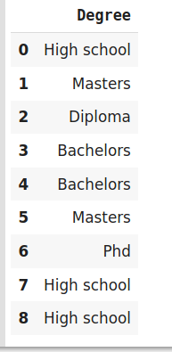
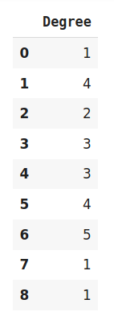

<b> One Hot Encoding </b> - Splits n unique attributes into n feature columns where 1 is placed into the column if the datapoint contains such attribute otherwise 0 is placed. 
 

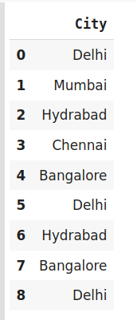
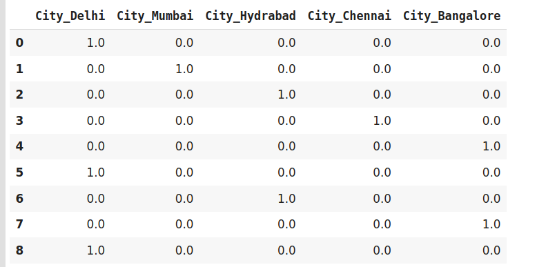

<b> Dummy Encoding </b> - This is similar to One Hot Encoding however it differs as dummy encoding using -1 binary variables meaning dummy encoding will have a row with 0 0 0 within the dataset.
 

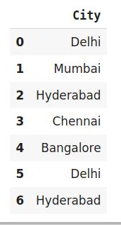
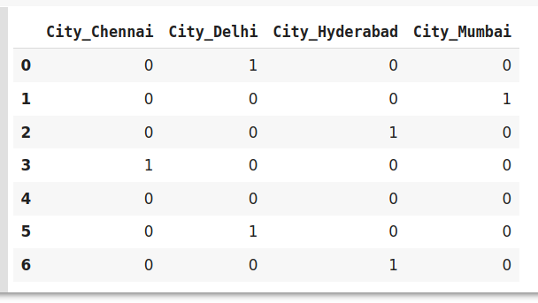

<b> Effect Encoding </b> - This is similar to Dummy Encoding however it different as effect encoding uses -1 instead of a row of all zeros which would look as -1 -1 -1.
 

<b> Hash Encoder </b> - Just like one-hot encoding, the Hash encoder represents categorical features using the new dimensions. By default, the Hashing encoder uses the md5 hashing algorithm but a user can pass any algorithm of his choice.
 

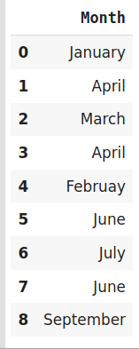
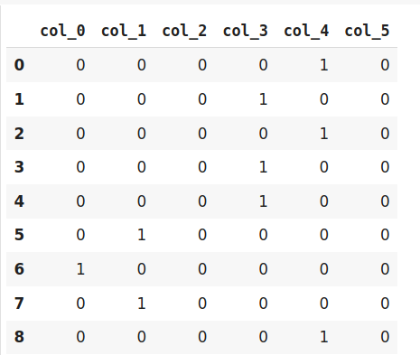

<b> Binary Encoding </b> - Binary encoding is a combination of Hash encoding and one-hot encoding. In this encoding scheme, the categorical feature is first converted into numerical using an ordinal encoder. Then the numbers are transformed in the binary number.
 

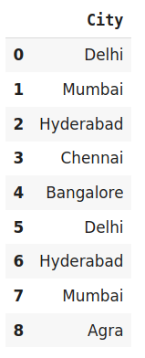
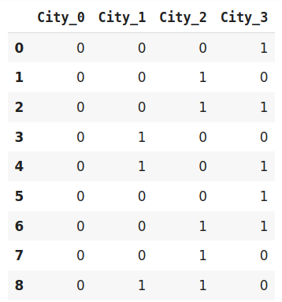

<b> Base N Encoding </b> - For Binary encoding, the Base is 2 which means it converts the numerical values of a category into its respective Binary form. If you want to change the Base of encoding scheme you may use Base N encoder. In the case when categories are more and binary encoding is not able to handle the dimensionality then we can use a larger base such as 4 or 8.
 

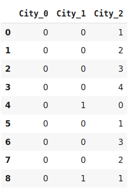

<b> Target Encoding </b> - In target encoding, we calculate the mean of the target variable for each category and replace the category variable with the mean value.
 

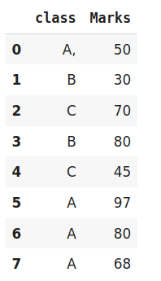
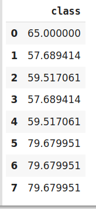

[Source: Encode Categorical Variables](https://www.analyticsvidhya.com/blog/2020/08/types-of-categorical-data-encoding/)

#### Handling Missing Values
<b> Deleting Rows with missing values </b>

Pros:
* A model trained with the removal of all missing values creates a robust model.

Cons:
* Loss of a lot of information.
* Works poorly if the percentage of missing values is excessive in comparison to the complete dataset.

<b> Using the mean/medium - Impute missing values for continuous variable </b>

Pros:
* Prevent data loss which results in deletion of rows or columns
* Works well with a small dataset and easy to implement.

Cons:
* Works only with numerical continuous variables.
* Can cause data leakage
* Does not factor the covariance between features.

<b> Using most frequent category - Impute missing values for categorical variable </b>

Pros:
* Prevent data loss which results in deletion of rows or columns
* Works well with a small dataset and easy to implement.
* Negates the loss of data by adding a unique category

Cons:
* Works only with categorical variables.
* Addition of new features to the model while encoding, which may result in poor performance

<b> Using Algorithms that support missing values </b>

Algorithms :
* k-NN
* Naive Bayes

Pros:
* No need to handle missing values in each column as ML algorithms will handle it efficiently

Cons:
* No implementation of these ML algorithms in the scikit-learn library.

<b> Prediction of missing values </b>

Algorithms :
* missforest

Pros:
* Gives a better result than earlier methods

Cons:
* Considered only as a proxy for the true values

[Source: Handling Missing Values](https://towardsdatascience.com/7-ways-to-handle-missing-values-in-machine-learning-1a6326adf79e)

### Cross Validation
### Non-exhaustive Methods
#### Hold Out Method

The dependent variable (target variable - what you're trying to predict) and the independent variables should be split into x and y variables.
Where x holds all the independent variables and y holds the y variable. X will normally have multiple feature columns whereas 
Y will have a single feature column. 

1. <b> Training set </b>: A set of examples used for learning, that is to fit the parameters of the classifier.
2. <b> Validation set </b>: A set of examples used to tune the parameters of a classifier, for example to choose the number of hidden units in a neural network.
3. <b> Test set </b>: A set of examples used only to assess the performance of a fully-specified classifier.

This data is normally broken down into 80 train - 20 test. Test data is then split into 10 test - 10 validation.
These numbers are subjective and can be changed as needed.

Common split percentages include:
* Train: 80%, Test: 20%
* Train: 67%, Test: 33%
* Train: 50%, Test: 50%

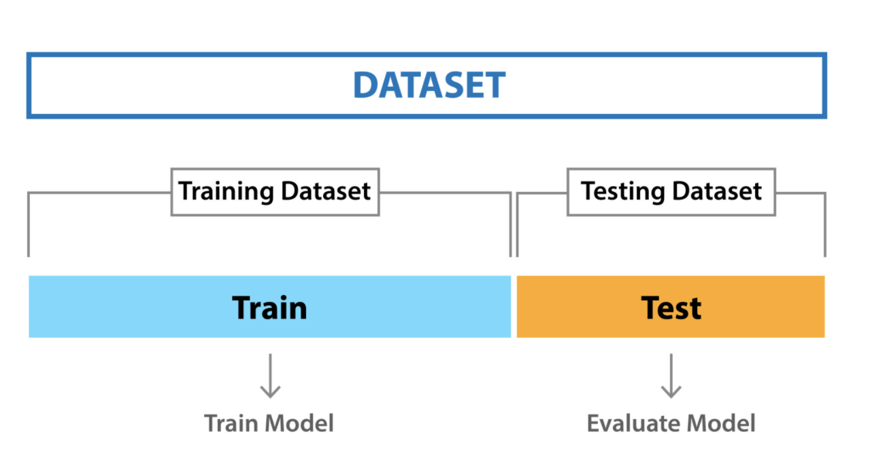

#### k-Fold Cross Validation

The general procedure is as follows:

* Shuffle the dataset randomly.
* Split the dataset into k groups
* For each unique group:
1. Take the group as a hold out or test data set
2. Take the remaining groups as a training data set
3. Fit a model on the training set and evaluate it on the test set
4. Retain the evaluation score and discard the model
* Summarize the skill of the model using the sample of model evaluation scores

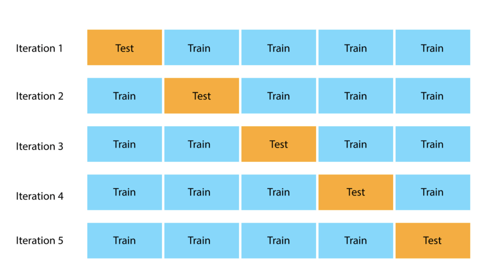

#### Stratified K Fold Cross Validation

Stratified K Fold Cross Validation works similar to k-Fold Cross Validation. It differs in the since that the stratification is the process of rearranging the data so as to ensure that each fold is a good representative of the whole. For example, in a binary classification problem where each class comprises of 50% of the data, it is best to arrange the data such that in every fold, each class comprises of about half the instances.

### Exhaustive Methods
#### Leave-P-Out cross validation

We take p number of points out from the total number of data points in the dataset(say n). While training the model we train it on these (n – p) data points and test the model on p data points. We repeat this process for all the possible combinations of p from the original dataset. Then to get the final accuracy, we average the accuracies from all these iterations.

#### Leave-one-out cross validation
This is a simple variation of Leave-P-Out cross validation and the value of p is set as one. This makes the method much less exhaustive as now for n data points and p = 1, we have n number of combinations.

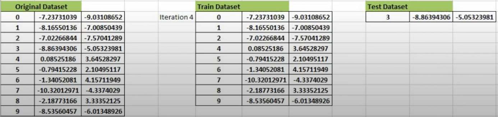

[Source: Train vs. Test vs. Validation set](https://machinelearningmastery.com/difference-test-validation-datasets/)

[Source: Common split percentages](https://machinelearningmastery.com/train-test-split-for-evaluating-machine-learning-algorithms/)

[Source: Cross Validation](https://www.mygreatlearning.com/blog/cross-validation/#sh211)

[Source: LOOCV and LPOCV Video](https://www.youtube.com/watch?v=yxqcHWQKkdA)

#### Handling imbalanced data
1. <b> Oversampling </b> - Random oversampling involves randomly duplicating examples from the minority class and adding them to the training dataset.
2. <b> Undersampling </b> - Random undersampling involves randomly selecting examples from the majority class to delete from the training dataset.
3. <b>Synthetic Minority Oversampling TEchnique (SMOTE) </b> - SMOTE draws artificial samples by choosing points that lie on the line connecting the rare observation to one of its nearest neighbors in the feature space.
4. <b> Random OverSampling Examples (ROSE) </b> - ROSE uses smoothed bootstrapping to draw artificial samples from the feature space neighbourhood around the minority class.

[Source: Over and Undersampling](https://machinelearningmastery.com/random-oversampling-and-undersampling-for-imbalanced-classification/)

[Source: ROSE and SMOTE explained](https://stats.stackexchange.com/questions/166458/rose-and-smote-oversampling-methods)

[Source: ROSE and SMOTE in R](https://topepo.github.io/caret/subsampling-for-class-imbalances.html#resampling)

#### Regularization
Regularization is an approach to address over-fitting in ML to help reduce the variance of the model.

L1 regularization tries to estimate the median of the data while the L2 regularization tries to estimate the mean of the data to avoid overfitting.
L1 tends to shrink coefficients to zero whereas L2 tends to shrink coefficients evenly. L1 is therefore useful for feature selection, as we can drop any variables associated with coefficients that go to zero. L2, on the other hand, is useful when you have collinear/codependent features.

[Source: Regularization Explained AI](https://explained.ai/regularization/L1vsL2.html)

[Source: Regularization Medium](https://medium.com/analytics-vidhya/l1-vs-l2-regularization-which-is-better-d01068e6658c)
 
#### Bayes Theorem
Describes the probability of an event, based on prior knowledge of conditions that might be
related to the event.

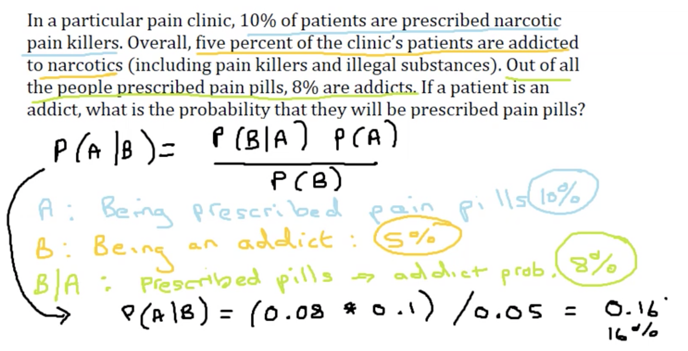

[Source: Bayse Example](https://www.statisticshowto.com/probability-and-statistics/probability-main-index/bayes-theorem-problems/)

#### Basic Stats
1. Likelihood - Generally maximizing the chances of a particular situation to occur. Probability attaches to possible results.
2. Probability - Finding the chance of occurrence of a particular situation. Likelihood attaches to hypotheses.
3. Standard Deviation - A measure of how spread out numbers are.
4. Variance - Measures variability from the average or mean.
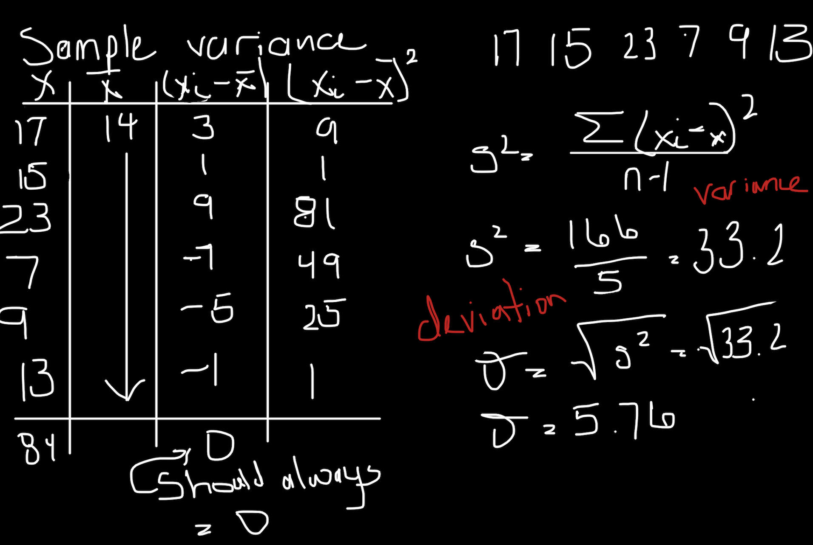

5. Z-Test - The statistical hypothesis which is used in order to determine that whether the two samples means calculated are different in case the standard deviation is available and sample is large.
6. T-Test - To determine a how averages of different data sets differs from each other in case standard deviation or the variance is not known.

Conditions to use T-test
* Standard Deviation is unknown
* Sample size < 30

[Source: Likelihood vs Probability](https://medium.com/swlh/probability-vs-likelihood-cdac534bf523)

[Source: Standard Deviation](https://www.investopedia.com/terms/v/variance.asp)

[Source: Variance](https://www.mathsisfun.com/data/standard-deviation.html)

[Source: When to use Z vs. T-Test](https://www.youtube.com/watch?v=YsalXF5POtY)

[Source: Z vs. T-Test](https://www.wallstreetmojo.com/z-test-vs-t-test/)

#### Stats for Measuring Significance
<b> Statistical Hypothesis Tests </b>

* Hypothesis - claim to be tested 
* Null Hypothesis - commonly accepted fact (Grades due to poor teaching performance)
* Alternative Hypothesis - claim to be tested (Grades due to lack of ventilation)
* Outcomes: Reject the null hypothesis or fail to reject the null hypothesis
* Confidence Level: Indicates the confidence you have in your results

<b> P-Values </b>

* Note: Used to see the significance of a feature 
* The p-value is the probability of obtaining results at least as extreme as the observed results of a statistical hypothesis test, assuming that the null hypothesis is correct. A smaller p-value means that there is stronger evidence in favor of the alternative hypothesis.

Common significant levels include:
* 0.5
* 0.1
* 0.001

<b> ANOVA (Multi-Level Categorical | Categorical vs. Numeric) </b>

* Analysis of variance (ANOVA) can determine whether the means of  two or more groups are different (SE, SES, and SEL)
* One-way ANOVA is used when you want to study the relationship between one independent categorical variable and a numeric response variable
* Multi-way ANOVA is used when you want to study the relationship between multiple independent categorical variables and a numeric response variable

<b> Crosstabs (Categorical vs. Categorical) </b>

* Crosstabs (or contingency tables) are used to study the relationship between two nominal variables. A crosstab  is a table in which the rows are the levels of one variable, while the columns are the levels of another. Counts in each of the table's cells indicate the number of values falling into the particular row and column combination.

<b> Chi Square Test (Categorical vs. Categorical) </b>

* Test for independence between the two nominal variables using the crosstab (contingency table). 
* The test measures how likely it is that the difference in the cell counts in the table is due to chance alone.
* If the probability is very low, it provides strong evidence that the two variables are associated.
* If the chi-square test statistics is greater than the critical value, the null hypothesis is rejected and we can conclude that the two sample variables are not independent

Please note: 

* Chi-square does not tell us anything about the strength of association between two nominal variables. If you want to know strength of association, you should use other measures such as odds ratio, relative risk, etc.
* For very large sample sizes, even very small unimportant differences are detectable which means you can get a very small p-value close to zero even for very weak associations

<b> Correlation (Numeric vs. Numeric) </b>

* Scatter plots are two dimensional diagrams in which dots are drawn on a coordinate plane using the values of one feature to provide the horizontal x coordinates and the values of another feature to provide the vertical y coordinates.
* Sample Covariance:   is a measure of how much two variables “co-vary”.  How much (and in what direction) we expect one variable to change when the other one changes
* Correlation (AKA Pearson Correlation Coefficient) is often used instead of covariance to quantify the extent of linear relationship between two continuous variables

[Source: Hypothesis](https://www.statisticshowto.com/probability-and-statistics/hypothesis-testing/)

[Source: P-Values](https://www.investopedia.com/terms/p/p-value.asp)

#### Distributions 
<b> Bernoulli Distribution </b>

A Bernoulli distribution has only two possible outcomes, namely 1 (success) and 0 (failure), and a single trial. So the random variable X which has a Bernoulli distribution can take value 1 with the probability of success, say p, and the value 0 with the probability of failure, say q or 1-p.

The probabilities of success and failure need not be equally likely, like the result of a fight between me and Undertaker. He is pretty much certain to win. So in this case probability of my success is 0.15 while my failure is 0.85

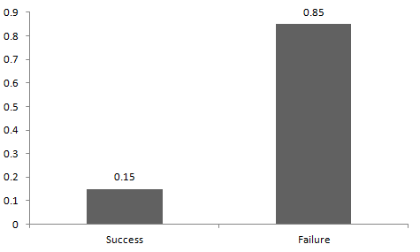

<b> Uniform Distribution </b>

When you roll a fair die, the outcomes are 1 to 6. The probabilities of getting these outcomes are equally likely and that is the basis of a uniform distribution. 

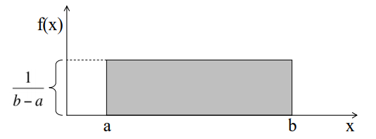

<b> Binomial Distribution </b>

A distribution where only two outcomes are possible, such as success or failure, gain or loss, win or lose and where the probability of success and failure is same for all the trials is called a Binomial Distribution.

On the basis of the above explanation, the properties of a Binomial Distribution are:
1. Each trial is independent.
2. There are only two possible outcomes in a trial- either a success or a failure.
3. A total number of n identical trials are conducted.
4. The probability of success and failure is same for all trials. (Trials are identical.)

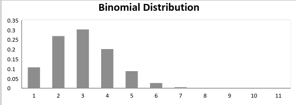

<b> Normal (Gaussian) Distribution </b>

Normal distribution represents the behavior of most of the situations in the universe.The large sum of (small) random variables often turns out to be normally distributed, contributing to its widespread application. 

Any distribution is known as Normal distribution if it has the following characteristics:

1. The mean, median and mode of the distribution coincide.
2. The curve of the distribution is bell-shaped and symmetrical about the line x=μ.
3. The total area under the curve is 1.
4. Exactly half of the values are to the left of the center and the other half to the right.

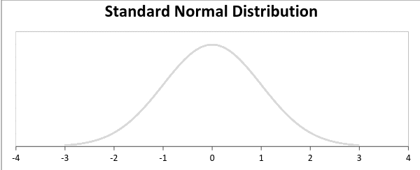

<b> Poisson Distribution </b>

Poisson Distribution is applicable in situations where events occur at random points of time and space wherein our interest lies only in the number of occurrences of the event.

Examples:

1. The number of emergency calls recorded at a hospital in a day.
2. The number of thefts reported in an area on a day.

A distribution is called Poisson distribution when the following assumptions are valid:

1. Any successful event should not influence the outcome of another successful event.
2. The probability of success over a short interval must equal the probability of success over a longer interval.
3. The probability of success in an interval approaches zero as the interval becomes smaller.

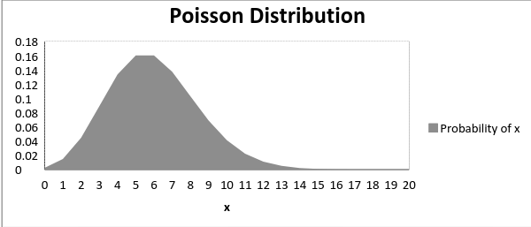

<b> Exponential Distribution </b>

Exponential distribution is widely used for survival analysis. From the expected life of a machine to the expected life of a human, exponential distribution successfully delivers the result.

Examples:

1. Length of time beteeen metro arrivals,
2. Length of time between arrivals at a gas station

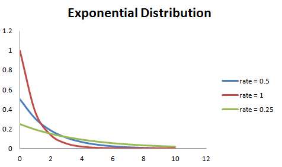

[Source: Distributions](https://www.analyticsvidhya.com/blog/2017/09/6-probability-distributions-data-science/)

#### Different Visualization to Use for Bivariate Analysis
Numeric vs Numeric variables
1. Scatterplots
2. Heatmap

Categorical vs Categorical variables
1. Bar char
2. Histogram

Numeric vs Categorical variables
1. Side-by-side box plot

Time series
1. Line chart

#### Learning Type
<b> Supervised </b>

* Supervised learning uses labeled input and output data
* The algorithm “learns” from the training dataset by iteratively making predictions on the data and adjusting for the correct answer
* Tend to be more accurate than unsupervised learning models

<b> Unsupervised </b>

* Unsupervised learning models are used for three main tasks: clustering, association and dimensionality reduction:
* Work on their own to discover the inherent structure of unlabeled data

#### Learning Task
1. <b> Classification </b> refers to a predictive modeling problem where a class label is predicted for a given example of input data.
2. <b> Regression </b> analysis consists of a set of machine learning methods that allow us to predict a continuous outcome variable (y) based on the value of one or multiple predictor variables (x).
3. <b> Reinforcement learning </b> is a machine learning training method based on rewarding desired behaviors and/or punishing undesired ones. In general, a reinforcement learning agent is able to perceive and interpret its environment, take actions and learn through trial and error.
4. <b> Meta-Learning </b> refers to learning algorithms that learn from other learning algorithms. Most commonly, this means the use of machine learning algorithms that learn how to best combine the predictions from other machine learning algorithms in the field of ensemble learning.
5. <b> Time series </b> pertains to the sequence of observations collected in constant time intervals be it daily, monthly, quarterly or yearly.

### Evaluations
#### Classification 
<b> Prediction Probabilities </b>

During training prediction probability can be use to output the probability of either being yes or no along with it's predicted vs. actual results. 

For example what if we were predicting yes/no instances:

|actual|predicted|no|yes|
|---|---|---|---|
|no|no|0.8782163|0.1217837|
|yes|no|0.3117222|0.6882778|

Many classifiers (such as logistic regression) provide the estimated probability of prediction. These prediction probabilities provide useful data to evaluate a model's performance. If two models make the same number of mistakes, but one is more capable of accurately assessing its uncertainty, then it is a better model.

<b> Classification Accuracy </b>

Classification accuracy is perhaps the simplest metrics one can imagine, and is defined as the number of correct predictions divided by the total number of predictions, multiplied by 100.

<b> Confusion Matrix </b>

A confusion matrix, also known as an error matrix, is a table that categorizes predictions according to whether they match the actual values. One of the table's dimensions indicates the possible categories of predicted values, while the other dimension indicates the categories for actual values.

The relationship between the positive class and negative class predictions can be depicted as a 2 x 2 confusion matrix that tabulates whether predictions fall into one of the four categories:

* True Positive (TP): An “yes” case correctly classified as “yes” case
* True Negative (TN): A “no” case correctly classified as “no” case 
* False Positive (FP) or Type I error: A “no” case incorrectly classified as “yes” case 
* False Negative (FN) or Type II error: An “yes” case incorrectly classified as “no” case

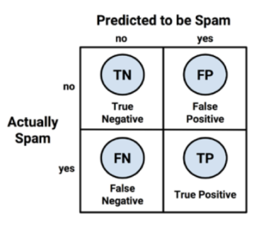

* <b> Accuracy </b>

Accuracy is the quintessential classification metric. It is pretty easy to understand. And easily suited for binary as well as a multiclass classification problem.

Accuracy = (TP+TN)/(TP+FP+FN+TN)

When to use?

Accuracy is a valid choice of evaluation for classification problems which are well balanced and not skewed or No class imbalance.

* <b> Precision </b>

Answers the following question: What proportion of predicted Positives is truly Positive?

Precision = (TP)/(TP+FP)

When to use?

Precision is a valid choice of evaluation metric when we want to be very sure of our prediction. For example: If we are building a system to predict if we should decrease the credit limit on a particular account, we want to be very sure about our prediction or it may result in customer dissatisfaction.

* <b> Recall </b>

Answers the following question: What proportion of actual Positives is correctly classified?

Recall = (TP)/(TP+FN)

When to use?

Recall is a valid choice of evaluation metric when we want to capture as many positives as possible. For example: If we are building a system to predict if a person has cancer or not, we want to capture the disease even if we are not very sure.

* <b> F1-score </b>

The F1 score is a number between 0 and 1 and is the harmonic mean of precision and recall.

One drawback of the F-measure is that it assigns equal weights to precision and recall. For this reason it is also called the F1-measure. 

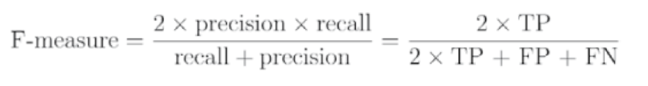

When to use?

We want to have a model with both good precision and recall.

* <b> Sensitivity and Specificity </b>

Sensitivity and specificity are two other popular metrics mostly used in medical and biology related fields, and are defined as:

Sensitivity = Recall = TP/(TP+FN)

Specificity = True Negative Rate = TN/(TN+FP)

* <b> Kappa Statistics </b>

The kappa statistic, also called Cohen’s kappa statistic, adjusts accuracy by accounting for the possibility of a correct prediction by chance alone. 

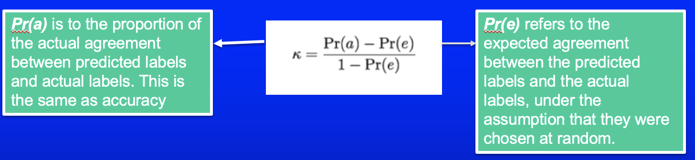

When to use?

This is especially important for datasets with a severe class imbalance, because a classifier can obtain high accuracy simply by always guessing the most frequent class.

* <b> Receiver Operating Characteristic Curve (ROC) </b>

The perfect prediction method would yield a point with coordinates (0,100%) in the upper left corner of the ROC space, representing 100% sensitivity (no false negatives) and 100% specificity (no false positives). 

A completely random guess would produce a point along a diagonal line (the so-called line of no-discrimination) from the left bottom to the top right corner. The diagonal line divides the ROC space into two halves. Points above the diagonal represent classification results that are better than random, whereas points below the diagonal line represent poor results, which are worse than random guess.

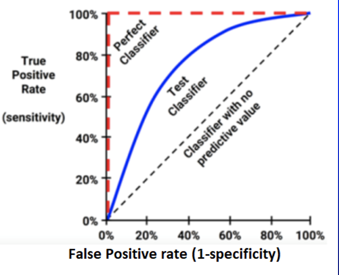

As an example your model may predict the below probabilities for 4 sample images: [0.45, 0.6, 0.7, 0.3]. Then depending on the threshold values below, you will get different labels:
* cut-off= 0.5: predicted-labels= [0,1,1,0] (default threshold)
* cut-off= 0.2: predicted-labels= [1,1,1,1]
* cut-off= 0.8: predicted-labels= [0,0,0,0]

As you can see by varying the threshold values, we will get completely different labels. And as you can imagine each of these scenarios would result in a different precision and recall (as well as TPR, FPR) rates.

* <b> Area Under the Curve (AUC) </b>

The area under the curve (AUC), is an aggregated measure of performance of a binary classifier on all possible threshold values (and therefore it is threshold invariant).

AUC calculates the area under the ROC curve, and therefore it is between 0 and 1. One way of interpreting AUC is as the probability that the model ranks a random positive example more highly than a random negative example.

On high-level, the higher the AUC of a model the better it is. But sometimes threshold independent measure is not what you want, e.g. you may care about your model recall and require that to be higher than 99% (while it has a reasonable precision or FPR). In that case, you may want to tune your model threshold such that it meets your minimum requirement on those metrics (and you may not care even if you model AUC is not too high).

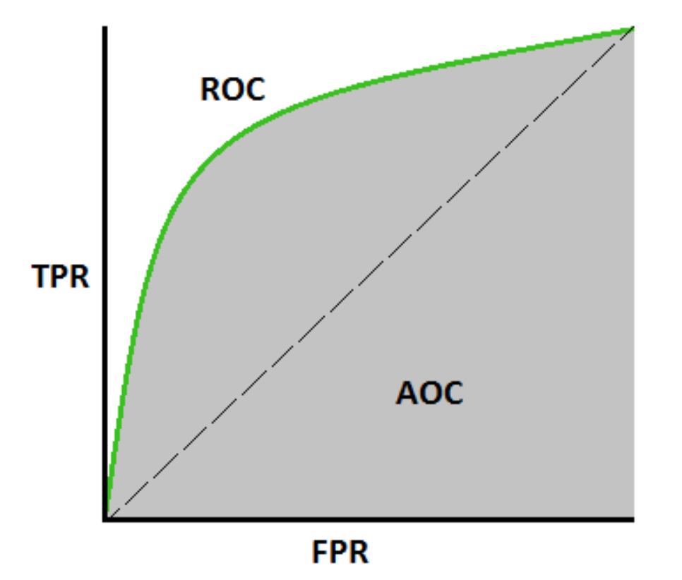

#### Regression
<b> Mean Squared Error (MSE) </b>

It is one of the most commonly used metrics, but least useful when a single bad prediction would ruin the entire model's predicting abilities, i.e when the dataset contains a lot of noise. It is most useful when the dataset contains outliers, or unexpected values (too high or too low values).

<b> Root Mean Squared Error (RMSE) </b>

In RMSE, the errors are squared before they are averaged. This basically implies that RMSE assigns a higher weight to larger errors. This indicates that RMSE is much more useful when large errors are present and they drastically affect the model's performance. It avoids taking the absolute value of the error and this trait is useful in many mathematical calculations. In this metric also, lower the value, better is the performance of the model.

<b> Mean Absolute Error (MAE) </b>

MAE is known to be more robust to the outliers than MSE. It is not very sensitive to outliers in comparison to MSE since it doesn't punish huge errors. It is usually used when the performance is measured on continuous variable data. It gives a linear value, which averages the weighted individual differences equally. The lower the value, better is the model's performance.

<b> R Squared </b>

Like correlation, R² tells you how related two things are. However, we tend to use R² because it’s easier to interpret. R² is the percentage of variation (i.e. varies from 0 to 1) explained by the relationship between two variables.

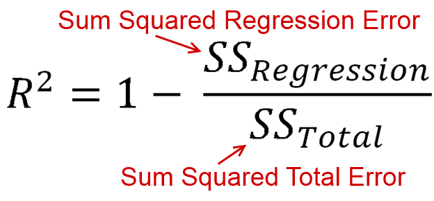

[Source: F1-Score, Recall, Precision and Accuracy](https://towardsdatascience.com/the-5-classification-evaluation-metrics-you-must-know-aa97784ff226)

[Source: ROC, AUC Sensitivity and Specificity](https://towardsdatascience.com/20-popular-machine-learning-metrics-part-1-classification-regression-evaluation-metrics-1ca3e282a2ce)

[Source: MAE, MSE and RMSE](https://www.studytonight.com/post/what-is-mean-squared-error-mean-absolute-error-root-mean-squared-error-and-r-squared)

[Source: R Squared](https://towardsdatascience.com/statistics-for-machine-learning-r-squared-explained-425ddfebf667)

#### Models
|Model|Learning Type|Learning Task|Pros|Cons|
|---|---|---|---|---|
|(K) Nearest Neighbor|Supervised|Classification|Simplicity,Non-parametric (makes no assumptions),Great for simple predictions,    |   |
|Naive Bayes|Supervised|Classification|   |   |
|Decision Trees|Supervised|Classification|   |   |
|Classification Rule Learners|Supervised|Classification|   |   |
|Logistic Regression|Supervised|Classification|   |   |
|Linear Regression|Supervised|Regression|   |   |
|Model Trees|Supervised|Regression|   |   |
|Neural Networks|Supervised|Dual use|   |   |
|Support Vector Machines|Supervised|Dual use|   |   |
|Association Rules|Unsupervised|Pattern detection|   |   |
|K-means clustering|Unsupervised|Clustering|   |   |
|Bagging|Meta-Learning Algorithms|Dual use|   |   |
|Boosting|Meta-Learning Algorithms|Dual use|   |   |
|Random Forests|Meta-Learning Algorithms|Dual use|   |   |

# Fairness Fundamentals
#### What is fairness?
The first idea is to find legal support and check if there is any definitions that can be used to formulate fairness quantitatively. eg.(anti-discrimination laws)
1. Disparate treatment - A decision making process suffers from disparate treatment if its decisions are (partly) based on the subject’s sensitive attribute
2. Disparate impact - Its outcomes disproportionately hurt (or benefit) people with certain sensitive attribute values (e.g., females, blacks)

These two definitions, however, are too abstract for the purpose of computation. As a result, there is no consensus on the mathematical formulations of fairness.

#### Data-Based Debiasing Techniques

Group Level Fairness: 

Cons: 

1. Doesn't cover multiple independent groups
2. Recommended unqualified individuals 

Unfair on individual level
1. Unfair to individual with individuals without merit
2. Unfair to subgroups

<b> Unawareness </b>

This simply means we should not include the sensitive attribute as a feature in the training data. This notion is consistent with disparate treatment, which requires to not use the sensitive attribute.

Pros:

* Intuitive, easy to use and legal support(disparate treatment).

Cons:

* The fundamental limitation is that there can be many highly correlated features(e.g. neighborhood) that are proxies of the sensitive attribute(e.g. race). Thus, only removing the sensitive attribute is by no means enough.

<b> Individual Fairness </b>

The notion of individual fairness emphasizes on that: similar individuals should be treated similarly. Individual fairness is a relatively different notion. 

Pros:

Rather than focusing on group, as individuals, we tend to care more about the individuals. Besides, individual fairness is more fine-grained than any group-notion fairness: it imposes restriction on the treatment for each pair of individuals.

Cons:

It is hard to determine what is an appropriate metric function to measure the similarity of two inputs(Kim et al. FATML2018). In our case, it is hard to quantify the difference between two job candidates. Imagine three job applicants, A, B and C. A has a bachelor degree and 1 year related work experience. B has a master degree and 1 year related work experience. C has a master degree but no related work experience. Is A closer to B than C? If so, by how much? Such question is hard to answer since we cannot have the performance of A, B, and C (we cannot hire all three). Otherwise we can apply techniques in a field called metric learning. It becomes even worse when the sensitive attribute(s) comes into the play. If we should and how to count for the difference of group membership in our metric function?

<b> Demographic Parity (Group Fairness) </b>

Demographic Parity, also called Independence, Statistical Parity, is one of the most well-known criteria for fairness. The acceptance rates of the applicants from the two groups must be equal

Pros:

* Legal Support: “four-fifth rule” prescribes that a selection rate for any disadvantaged group that is less than four-fifths of that for the group with the highest rate. In our formulation, this is equivalent to satisfying 80% rule. If this rule is violated, justification as being job-related or a business necessity must be provided. “Business necessity means that using the procedure is essential to the safe and efficient operation of the business — and there are no alternative procedures that are substantially equally valid and would have less adverse impact”(source: Adverse Impact Analysis / Four-Fifths Rule).
* There are some papers that argue the enforcement of such criteria in short term benefits building up the reputation of the disadvantageous minority group in the labor market in the long run (Hu and Chen, WWW2018).

Cons:

* This definition ignores any possible correlation between Y and A. In particular, it rules out perfect predictor C=Y when base rates are different (i.e. P₀ [Y=1] ≠ P₁ [Y=1])
* laziness: if we hire the qualified from one group and random people from the other group, we can still achieve demographic parity.

<b> Equalized Odds (Group Fairness) </b>

Equalized odds, also called Separation, Positive Rate Parity, was first proposed in Hardt, Price and Srebro, 2016 and Zafar et al. WWW2017.

A weaker notion is: which is called Accuracy Parity. The limitation of this weaker notion is that we can trade false positive rate of one group for false negative rate of another group. Such trade is not desirable sometimes(e.g. trade rejecting(C=0) qualified applicants(Y=1) from group1 (A=0) for accepting(C=1) unqualified people(Y=0) from group2 (A=1) ).

In many applications(e.g. hiring), people care more about the true positive rate than true negative rate so many works focus on the following relaxed version: which is called <b> Equality of Opportunity. </b>

<b> Counterfactual fairness </b>

It provides a possible way to interpret the causes of bias.

A counterfactual value replaces the original value of the sensitive attribute. The counterfactual value propagates “downstream” the causal graph(see Fig6 for an example) via some structural equations. Everything else that are not descendant of the sensitive attribute remains the same.

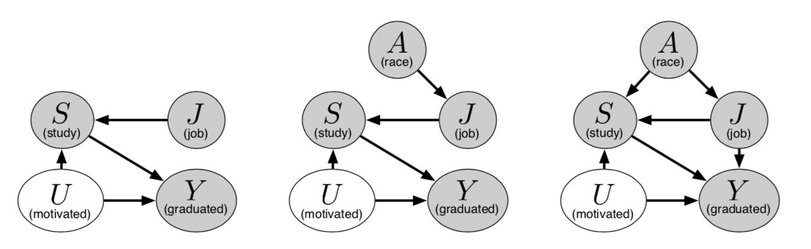

Pros:

Unawareness is far from being enough due to many correlated features. Demographic Parity, Equalized odds and Predictive Rate Parity are all observational fairness criteria. They cannot be used to find the cause of the unfairness phenomenon. Individual Fairness has fundamental limitation of finding the proper metric. Counterfactual fairness solved all these problems.

Counterfactual fairness provides a way to check the possible impact of replacing only the sensitive attribute. It provides a way of explaining the impact of bias via a causal graph. Fig6 shows several possible graphs in the scenario of applying to college. Notice that when we replace the sensitive attribute, all the other features that are correlated with it will also be influenced. In Fig6, if the sensitive attribute(race) is changed, the education score as well as work score will also change.

Cons:

The idea is very ideal. In practice, it is hard to reach a consensus in terms of what the causal graph should look like and it is even harder to decide which features to use even if we have such a graph (we may suffer large loss on accuracy if we eliminate all the correlated features).

<b> Augment data with counterfactuals </b>

For each sentence, it adds a new datapoint with the opposite gender nouns/pronouns.

Ex. Original - He went to the doctor. Augment - She went to the doctor.

Con:

This doesn't work well with non-english languages.

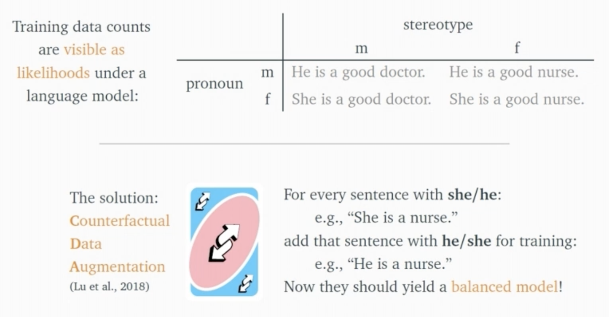

<b> Counterfactual Data Augmentation for Mitigating Gender Stereotypes in Languages with Rich Morphology </b>

The authors of the paper propose using Rich Morphology with counterfactuals to help decrease bias and keep correct grammar in different languages.

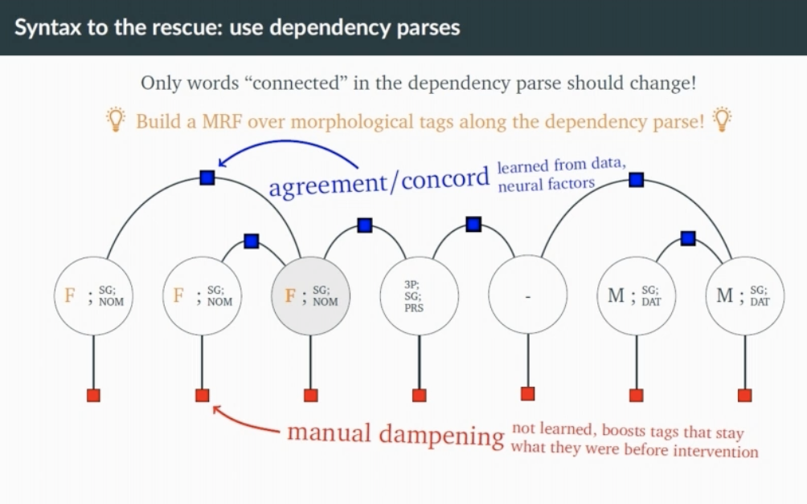

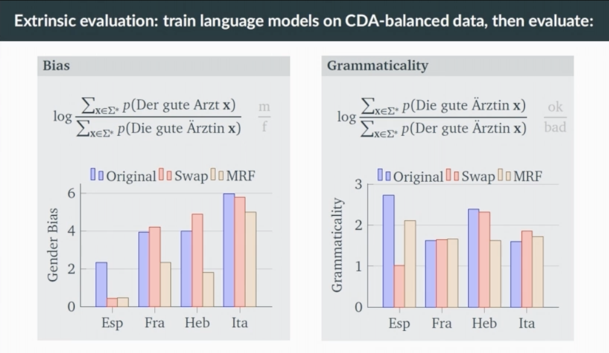

<b> Predictive Rate Parity (Group Fairness) </b>
 
<b> Equalize the number of datapoints </b>

1. Train on equal number of datapoints from the target demographics. 
* You might have noticed that making a selection of the dataset that equalizes the
number of datapoints per demographic/category. This makes the resulting dataset
size constrained to product of the size of the smallest demographic and the number
of demographics.
* In some cases, equalizing the ratio instead can lead to a higher resulting sample
size

2. Equal ratio of the number of datapoints per target level in each catergory
* This results into a higher sample size than equalizing the number of
datapoints

[Source: All other approaches](https://towardsdatascience.com/a-tutorial-on-fairness-in-machine-learning-3ff8ba1040cb)

[Source: Equalize the number of datapoints and Augment data with counterfactuals ](https://ocw.mit.edu/resources/res-ec-001-exploring-fairness-in-machine-learning-for-international-development-spring-2020/module-four-case-studies/case-study-mitigating-gender-bias/MITRES_EC001S19_video7.pdf)

[Source: Counterfactual Data Augmentation for Mitigating Gender Stereotypes in Languages with Rich Morphology](https://vimeo.com/384485394)

#### Causes of Bias Systems

They can be grouped into the following three problems:
* Discovering unobserved differences in performance:skewed sample, tainted examples
* Sample Coping with observed differences in performance: limited features, sample size disparity
* Understanding the causes of disparities in predicted outcome: proxies

<b> Skewed sample </b>

If by some chance some initial bias happens, such bias may compound over time: future observations confirm prediction and fewer opportunity to make observations that contradict prediction. One example is police record. The record of crimes only come from those crimes observed by police. The police department tends to dispatch more officers to the place that was found to have higher crime rate initially and is thus more likely to record crimes in such regions. Even if people in other regions have higher crime rate later, it is possible that due to less police attention, the police department still record that these regions have lower crime rate. The prediction system trained using data collected in this way tends to have positive bias towards regions with less police.

<b> Tainted examples </b>

Any ML system keeps the bias existing in the old data caused by human bias. For example, if a system uses hiring decisions made by a manager as labels to select applicants rather than the capability of a job applicants (most of time this capability is unobserved for people who are rejected). The system trained using these samples will replicate the bias existing in the manager’s decisions(if there are any). Another example is that word embeddings trained on Google News articles “exhibit female/male gender stereotypes to a disturbing extent” e.g. the relationship between “man” and “computer programmers” was found to be highly similar to that between “woman” and “homemaker” (Bolukbasi et al. 2016).

<b> Limited features </b>

features may be less informative or reliably collected for minority group(s). If the reliability of the label from a minority group is much lower than the counterpart from a majority group, the system tends to have much lower accuracy for the prediction of the minority group due to these noise.

<b> Sample size disparity </b>

If the training data coming from the minority group is much less than those coming from the majority group, it is less likely to model perfectly the minority group.

<b> proxies </b>

Even if sensitive attribute(attributes that are considered should not be used for a task e.g. race/gender) is not used for training a ML system, there can always be other features that are proxies of the sensitive attribute(e.g. neighborhood). If such features are included, the bias will still happen. Sometimes, it is very hard to determine if a relevant feature is too correlated with protected features and if we should include it in training.

#### Bias Mitigation

<b> Pre-Processing Bias Mitigation </b>
<b> In-Processing Bias Mitigation </b>
<b> Post-Processing Bias Mitigation </b>

#### Fariness vs. Accuracy 

- Which models measure fairness?
- Where should there models be applied?
- Pros and Cons of each model 
- Who determines fairness?
- Different types of fairness
- Interception analysis
- Evaluations (Pros and Cons of each)

# Recommendation Fundamentals
- Recommendation system pipeline
- Which models can be used to predict
- Pros and Cons of each
- Evaluations (Pros and Cons of each)

# Testing Fundamentals
<b> A/B Testing </b>

A/B testing (also known as split testing or bucket testing) is a method of comparing two versions of a webpage or app against each other to determine which one performs better. AB testing is essentially an experiment where two or more variants of a page are shown to users at random, and statistical analysis is used to determine which variation performs better for a given conversion goal.

<b> Load/Stress Tests </b>

1. Load tests help you understand how a system behaves under an expected load.
2. Stress tests help you understand the upper limits of a system's capacity using a load beyond the expected maximum.

<b> Differential Tests </b>

Differential tests perform a comparison between the results of the currently released model and the next one that we plan to release, with the same input. The new model can be an incremental update of the one currently released. But it can be trained with a completely different algorithm or different architecture in a case with Neural Networks.

This kind of test is useful to detect errors that don’t raise exceptions, for example, bugs in the feature engineering code. We should tune these tests to some specified tolerance, i.e., the maximum value of the difference in the output results from both models, which doesn’t raise an error. In a case of incremental improvement of the released model, we should expect a small difference in the outputs. But, in a case with a different algorithm or NN schema, the difference in the results could be not that small.

[Source: A/B Testing](https://www.optimizely.com/optimization-glossary/ab-testing/)

[Source: Load/Stress Tests](https://loadninja.com/resources/articles/performance-testing/load-stress-testing/)

[Source: Differential Tests](https://blog.netcetera.com/testing-and-monitoring-machine-learning-model-deployments-ca878d93e518)

# Acknowledgement
Many thanks to my Machine Learning professor for the amazing slides from our classroom. It was a great help in my revision.