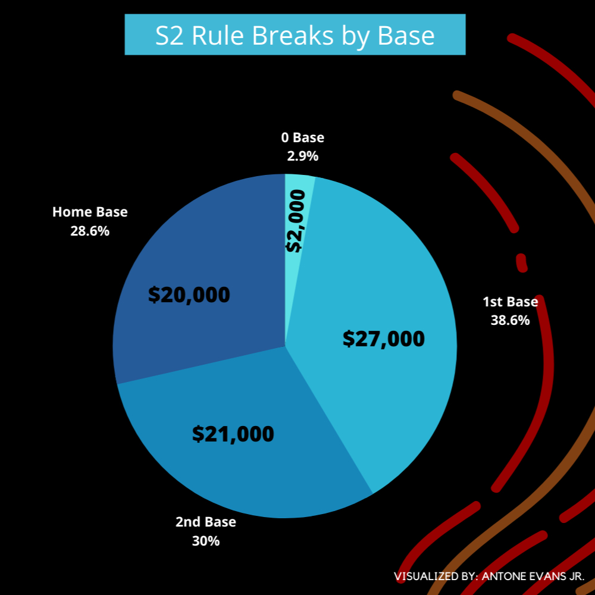
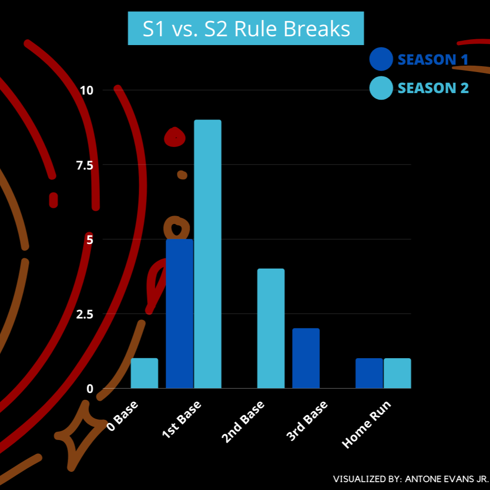
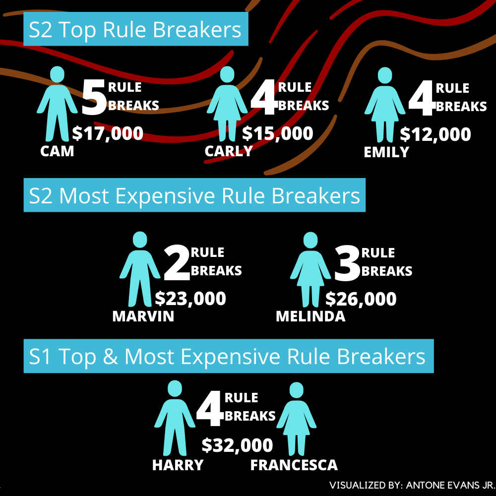
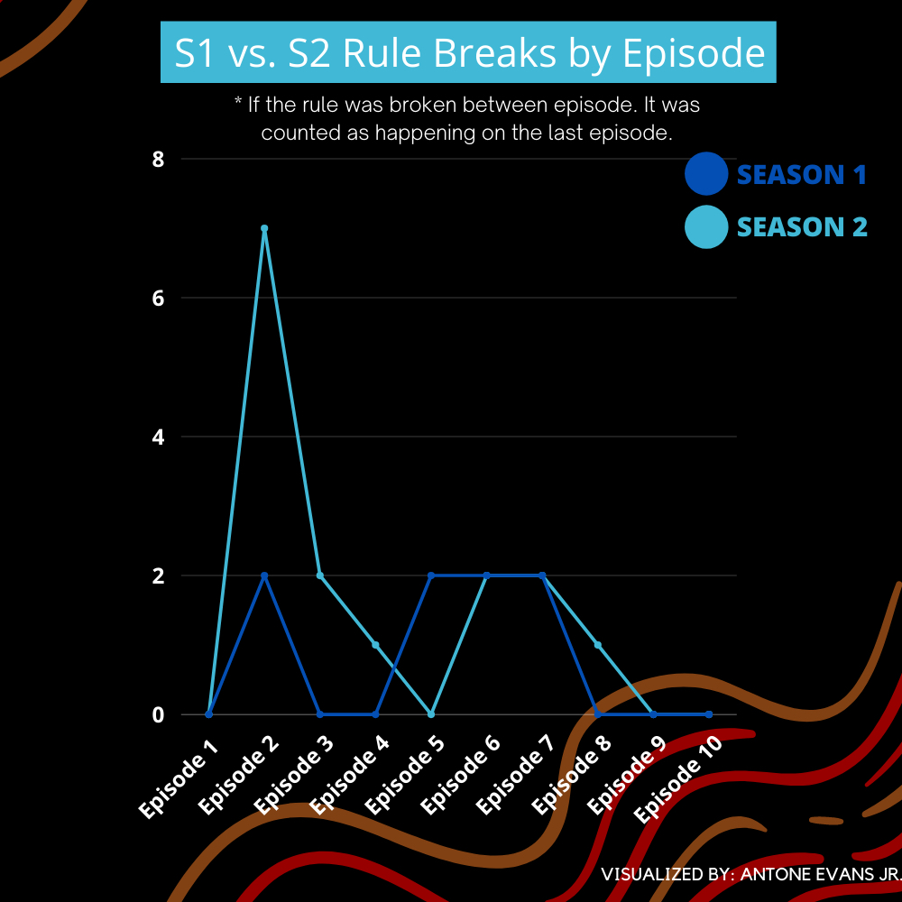

# Netflix - Too Hot To Handle S1 vs S2 Analysis 📺🔥

 After S2 of Too Hot To Handle took storm on Netflix, I found it fitting to analysis the difference between the two seasons and the rules broken.
 
 ## Key Takeaways
 
- 1st Base caught up with the S2 cast!
- The S2 cast outshined S1 on every base expect 3rd.
- In S2, the top/most expensive rule breakers are different members.
- The S2 cast started the show off with a bang, the 2nd day was the top rule breaking day.
- Both S1 & S2 had the same amount of rule breaks on Episodes 6 and 7.

